# Hks-chatgpt-tester-public

## 注意
研究室内で使用している大規模言語モデル（LLM）を用いた実験ツールの就活用限定公開版です。

<span style="color:red; text-decoration:underline;">使用にはGoogle API Keyを記入したuser_config.jsonの作成が必須です。</span>

Google API KeyはGoogleアカウントを用いて無料で作成が可能です。

gemini-2.0-flash をはじめとする一部のLLMモデルは無料で使用が可能です。

デフォルトの設定ではgemini-2.0-flashを使用します。

### 研究に用いているバージョンとの違い
大学の研究秘密保持誓約に従い、研究機密を含まない構成に変更しています。

本構成は本来のおよそ3分の１程度の大きさです。

本構成ではGeminiAPIとChatGPT APIのみ使用可能ですが、本来の構成では複数社のAPIに対応しています。

## 概要
LLMを用いた対話実験及び実験データの記録を行います。

実験データは指定のExcelファイルに表として保存されます。（デフォルトではlog/sample.xlsxに保存されます）

複数枚の画像入力にも対応しています。

### こだわりポイント

#### 安定した動作
想定されていない操作を受け付けず、正しい操作が入力されるまで、入力受付を繰り返す設計となっており、操作ミスによりエラーにより実験が強制終了することがありません。
万が一、エラーが生じた場合は、実験データを保存してからプログラムを終了するようになっており、実験データが失われることはありません。

#### 拡張性・メンテナンス性の高さ
SOLID原則に基づいたオブジェクト指向設計とDIコンテナの実装により、拡張性、メンテナンス性が高いです。

## 使いかた
※利用にはAPI keyを入力する必要があります。

### １．初回利用前にHKs_ChatGPT_tester/user_config.json.sample に自分のAPI keyを入力し，ファイル名をuser_config.jsonに書き換えて保存して下さい。
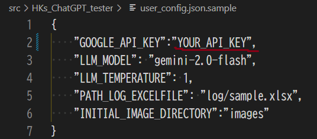


### ２．requirements.txtのライブラリをインストールして下さい。
```
pip install -r requirements.txt
```

### ３．run_gemini.pyまたは３．run_chatgpt.pyを実行して下さい。

user_config.jsonのLLM_MODELにGeminiモデル（例：gemini-2.0-flash）を入力している場合は、run_gemini.pyを実行してください。

user_config.jsonのLLM_MODELにOpenAIモデル（例：gpt-4o）を入力している場合は、run_chatgpt.pyを実行してください。

### ４．プロンプトまたはコマンドの数字を入力することでLLMからの返答や様々な機能を利用できます。

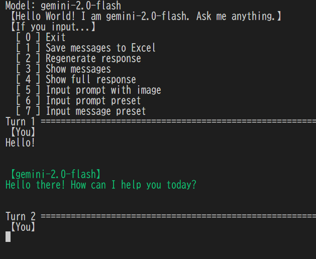


## 【システムコマンドを使った操作】

実行後最初に表示されるシステムコマンド（0~の数字）を入力するとコマンドに対応する動作が行われます。

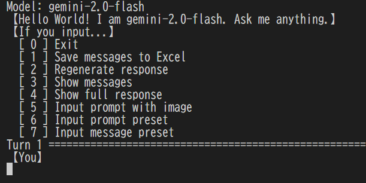

### ・Exit：
プログラムを終了することが出来ます。

終了前に履歴を保存するか否かを選択できます。

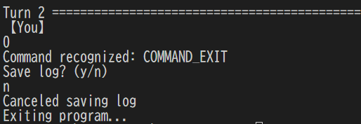

### ・Save messages to Excel
やり取りをエクセルファイルに保存します。保存先はuser_config.jsonで指定できます。（デフォルトではlog/sample.xlsxに保存されます）

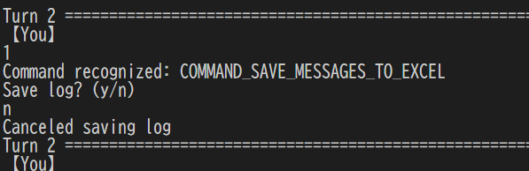

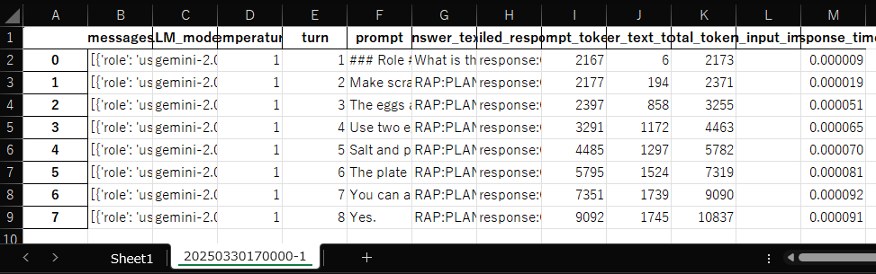

### ・Regenerate response：
直前のプロンプトによる回答の生成をもう一度行います。

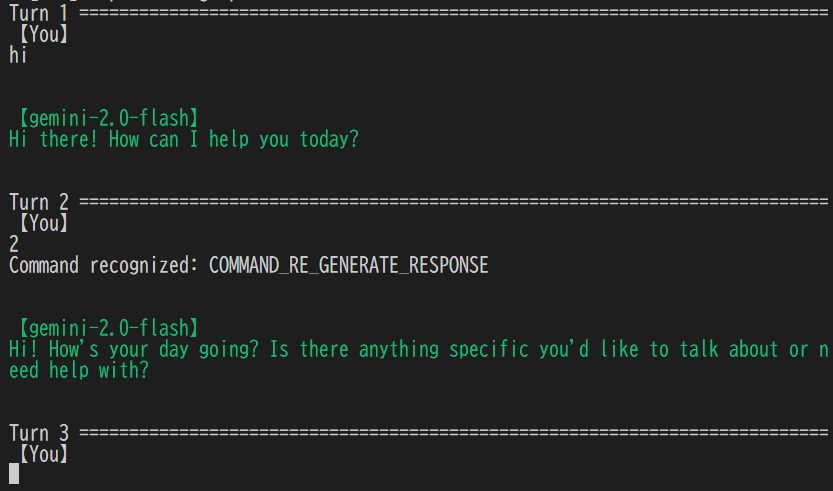

### ・Show messages：
回答の生成に用いたmessagesの全文を表示します。

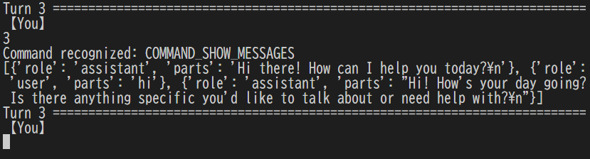

### ・Show full response：
生成されたresponseの全文を表示します。

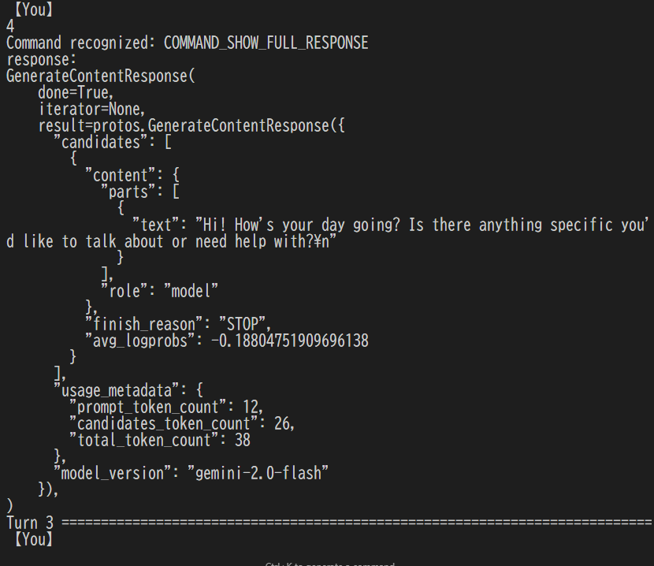

### ・Input prompt with image：
画像を入力することができます。

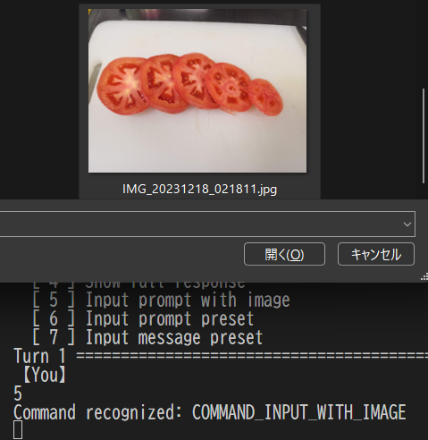
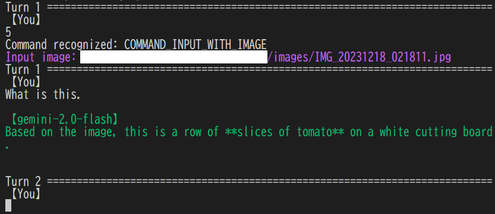


### ・Input prompt preset：
prompt_preset.pyに登録したプロンプトのプリセットをプロンプトとして回答をリクエストします。
登録されているプロンプトが一覧で表示されるので対応する数字を入力して選択してください。

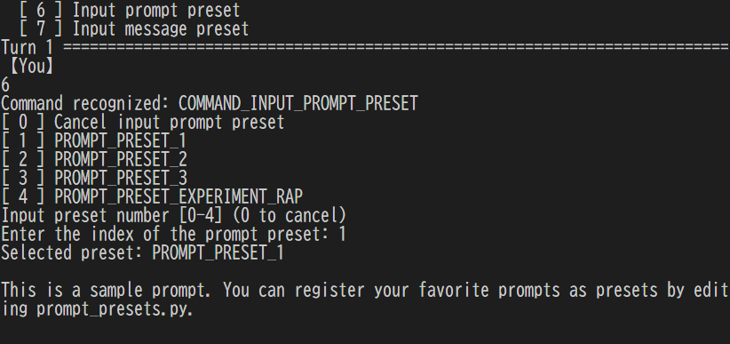

### ・Input message preset：
prompt_preset.pyに登録したmessage（対話履歴）のプリセットをmessageとして回答をリクエストします。
登録されているmessageが一覧で表示されるので対応する数字を入力して選択してください。

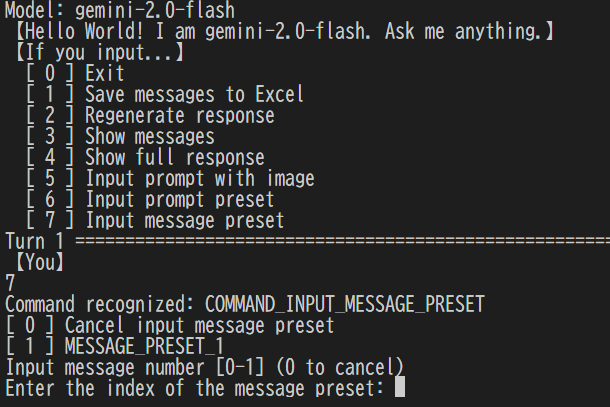


## 【オプションの管理】
その他のオプションはuser_config.jsonファイルで管理します。
初回利用時にGoogle API Keyを記入したuser_config.jsonの作成が必須です。
user_config.json.sampleをコピーして作成することを推奨します。


## 【プロンプト・メッセージプリセットの管理】
プロンプトプリセットはsrc/config/prompt_preset.pyにまとめられています。
それらを書き換えることでプロンプト・メッセージプリセットを管理できます。

# クラス図（UML）
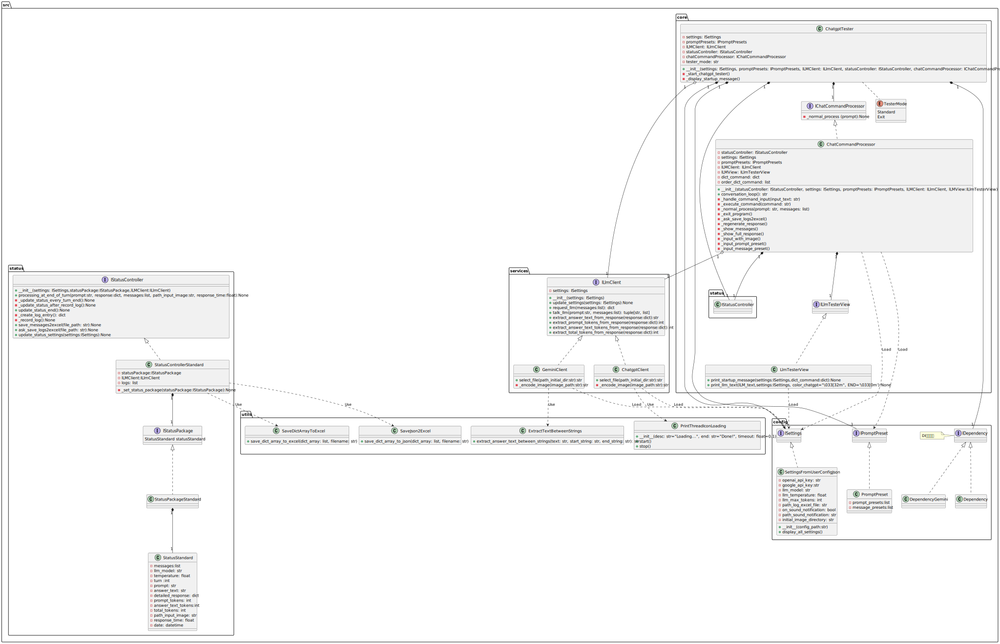

## 動作環境：
Windows11,python3.9.12

上記と異なるPythonバージョンで動作しない場合はバージョンを揃えてみてください。

### ----------------------------------------------------------------------------
### 制作者：堀 和希
### Email: kazukihori168@gmail.com
### -----------------------------------------------------------------------------
